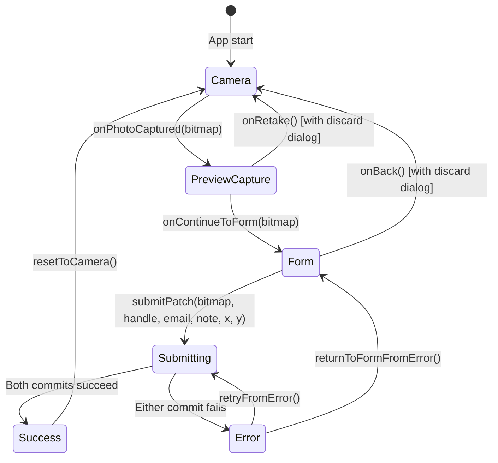

# Agent & Contributor Continuity Guide (`AGENT_GUIDE.md`)

> **For AI Agents & Developers**: Read this guide before modifying the codebase. It details the system architecture, design decisions, data contracts, and specific project constraints.

---

## 1. Project Mission & Context

- **App Name**: ZeThread
- **Event**: **next.app devCon** (formerly Droidcon Berlin)
- **Role**: A booth companion app for a collaborative, physical crochet tapestry.
- **Workflow**:
  1. An attendee crochets a physical square patch.
  2. Booth staff uses ZeThread to take a 1:1 photo of the patch.
  3. Contributor details are entered: `@handle`, Grid Position $(X, Y)$, and optional note.
  4. The app commits the photo and structured metadata directly to a GitHub repository using two sequential GitHub Contents API `PUT` calls.
  5. A downstream static site generator or Compose for Web app reads the repository to render an interactive virtual quilt.

---

## 2. Core Architectural Decisions

### A. Append-Only Directory Storage (No Shared JSON File)
- **Why**: Updating a single shared `tapestry.json` file via the GitHub Contents API requires sending the parent file's blob SHA. In a booth with multiple devices or rapid submissions, concurrent commits result in `409 Conflict` errors.
- **Solution**: Every contribution writes to its own isolated folder:
  ```text
  patches/patch_{YYYYMMDD_HHmmss}_{handleSlug}/
    ├── patch.jpg          # Compressed JPEG (~350-400KB, 90% quality)
    └── metadata.json      # Contributor info, coordinates (X, Y), and image_commit_sha
  ```
- This guarantees completely conflict-free, append-only commits.

### B. Two Sequential GitHub Contents API Calls
- **Call 1**: Pushes `patches/{patch_id}/patch.jpg`. Captures `imageResponse.commit.sha`.
- **Call 2**: Pushes `patches/{patch_id}/metadata.json` containing:
  ```json
  {
    "id": "patch_20261001_000316_louis993546",
    "author": { "handle": "louis993546", "name": "...", "email": "..." },
    "coordinates": { "x": 0, "y": 0 },
    "note": "Optional note",
    "timestamp": "2026-10-01T00:03:16Z",
    "image": "patch.jpg",
    "image_commit_sha": "e3cc010c0ebad58a4e39d540d7d58e9bef579987"
  }
  ```
- Downstream web renderers can link directly to the commit view:
  `https://github.com/{owner}/{repo}/commit/{image_commit_sha}`

### C. 1:1 WYSIWYG Viewfinder
- Modern phone screens are tall (19.5:9 or 20:9), while camera sensors are 4:3.
- `CameraScreen.kt` embeds `PreviewView(scaleType = FILL_CENTER)` directly inside a 1:1 square `Box`.
- As a result, the live viewfinder and the final cropped photo match **100% pixel-for-pixel** — no surprise zoom-outs or unexpected side margins.

### D. Image Compression & Threading
- **Format**: JPEG at 90% quality (`Bitmap.CompressFormat.JPEG`).
- **Resolution**: `MAX_IMAGE_DIMENSION = 2160`.
- **File size**: ~380 KB (down from 5.2 MB in raw PNG).
- **Threading**: `ImageUtils.bitmapToBase64Jpeg` **MUST** be called within `withContext(Dispatchers.Default)` so it never blocks the Main UI thread.

---

## 3. GitHub API & Rate Limiting Rules

- **Fine-Grained PATs**:
  - Scoped to `Only select repositories` with `Contents: Read and write`.
  - Used for authenticated commits (5,000 requests/hour limit).
- **User Profile Queries (`GET /users/{username}`)**:
  - The API version header is set to `2026-03-10`.
  - If a user lookup fails (e.g. rate-limited 403 on unauthenticated networks or 404), **NEVER block the user**.
  - The email field automatically pre-fills with `${handle}@users.noreply.github.com` so submissions can proceed even if user lookup fails or if offline.

---

## 4. UI State Machine (`TapestryViewModel.kt`)



- In-flight submissions (`Submitting`) disable back navigation.
- If the user tries to exit during `PreviewCapture` or `Form`, a confirmation dialog appears to protect against losing progress.

---

## 5. Guidelines for Future AI Agents

1. **NO Automated Screen Captures or Synthetic Tap Loops**:
   - The user has explicitly requested: do NOT run `android screen capture` or automate clicking in loops. Rely on the user to test UI interactions on device.
2. **Material 3 Expressive Design**:
   - Avoid boxing everything in rounded bordered cards.
   - Use standard `TopAppBar` and M3 surfaces.
   - Use monospace fonts (`CodeMonospace`) only for commit hashes, handles, and code/JSON.
3. **Build & Test Command**:
   - Always run `./gradlew testDebugUnitTest assembleDebug` to verify compilation and unit tests before declaring work complete.
