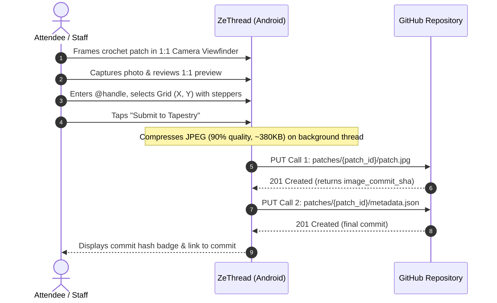

# ZeThread 🧶

An interactive Android companion app for the collaborative physical crochet tapestry booth at **next.app devCon** (formerly Droidcon Berlin).

Attendees crochet physical square patches at the convention booth. ZeThread lets them snap a photo of their patch, enter their developer handle and grid position $(X, Y)$, and commit it directly to a GitHub repository as an immutable Git commit.

---

## 🌟 How the Booth Workflow Works



1. **Snap & Crop**: The CameraX viewfinder is locked to a true **1:1 square aspect ratio** — what you see in the frame is pixel-for-pixel what gets captured and cropped.
2. **Metadata & Steppers**: The contributor enters their `@handle`. Grid coordinates $(X, Y)$ have quick `(+)` and `(-)` steppers for single-tap adjustments. The email automatically pre-fills with GitHub's privacy-protecting noreply email (`@users.noreply.github.com`) or can be customized.
3. **Two-Stage Atomic GitHub Commits**:
   - **Call 1**: Pushes `patches/{patch_id}/patch.jpg` directly via GitHub's Contents API.
   - **Call 2**: Pushes `patches/{patch_id}/metadata.json` referencing the coordinates $(X, Y)$ and the image commit SHA.
4. **Append-Only Architecture**: Each patch lives in its own folder (`patches/patch_{timestamp}_{handle}/`). This guarantees **zero 409 merge conflicts** even when multiple booth devices check in simultaneously over convention Wi-Fi.

---

## 🚀 Key Features

- **1:1 WYSIWYG Viewfinder**: CameraX viewfinder matches the confirmed photo dimensions and corner rounding exactly.
- **Fast & Lightweight JPEGs**: High-quality (90%) JPEG compression producing ~**380 KB** per patch (a **92.5% size reduction** compared to raw PNG) while maintaining full 2160px resolution.
- **Background Threading**: Image optimization and Base64 encoding run off the main UI thread via Kotlin coroutines (`Dispatchers.Default`), ensuring zero UI lag or dropped frames on submission.
- **Privacy-First Authorship**: If no custom email is entered, commits default to `username@users.noreply.github.com`, linking the patch to the contributor's GitHub profile without exposing private emails.
- **Offline / Mock Mode**: Built-in mock repository simulates all GitHub calls and displays detailed dispatch logs without requiring an internet connection or real GitHub token.
- **Material 3 Expressive UI**: Clean top app bars, edge-to-edge layout, and monospace typography reserved strictly for handles, hashes, and payload data.
- **Exit Protection**: Confirmation dialogs prevent accidental loss of staged photos if navigating back mid-flow.

---

## ⚙️ Setup & Configuration

The app stores its settings securely via Android Jetpack DataStore.

1. Tap the **Settings (⚙️)** icon in the top app bar.
2. Configure your repository:
   - **Repository Owner**: e.g. `louis993546`
   - **Repository Name**: e.g. `ZeThread-testing`
   - **Target Branch**: `main`
   - **Path Prefix**: `patches`
   - **Use Mock Mode**: Toggle **OFF** to talk to live GitHub, or **ON** for dry runs.
   - **Personal Access Token**: Paste a GitHub Fine-Grained Personal Access Token (PAT).
3. Tap **Save Settings (✓)**.

### Creating a Fine-Grained GitHub Token (PAT)
1. Go to [GitHub Settings $\rightarrow$ Developer settings $\rightarrow$ Fine-grained tokens](https://github.com/settings/tokens?type=beta).
2. Set **Repository access** to **Only select repositories**, and pick your tapestry repository.
3. Under **Permissions $\rightarrow$ Repository permissions**, set **Contents** to **Read and write**.
4. Generate the token and paste it into ZeThread.

---

## 🛠️ Building & Running

### Requirements
- Android Studio Ladybug / Meerkat or newer
- JDK 21
- Android SDK 35 (compileSdk), minSdk 26

### Gradle Commands
```bash
# Run unit tests
./gradlew testDebugUnitTest

# Assemble debug APK
./gradlew assembleDebug

# Install on a connected USB/Wi-Fi device
./gradlew installDebug
```

---

## 📂 Project Structure

```text
ZeThread/
├── app/src/main/java/de/berlindroid/zethread/
│   ├── MainActivity.kt               # Navigation router & discard confirmation dialogs
│   ├── ui/
│   │   ├── TapestryViewModel.kt      # Main state machine & GitHub submission coroutines
│   │   ├── screens/
│   │   │   ├── CameraScreen.kt       # CameraX 1:1 square viewfinder & photo review
│   │   │   ├── MetadataScreen.kt     # Contributor details & X/Y coordinate steppers
│   │   │   ├── FeedbackScreen.kt     # In-flight terminal logs & success/error states
│   │   │   └── SettingsScreen.kt     # Full-screen repository & token configuration
│   │   ├── components/               # Custom overlay brackets & visual framing
│   │   └── theme/                    # Material 3 theme colors & monospace typography
│   ├── data/
│   │   ├── local/                    # AppSettingsDataStore (Preferences DataStore)
│   │   ├── model/                    # Kotlinx Serialization models for GitHub API
│   │   ├── remote/                   # Retrofit GitHubApiService
│   │   └── repository/               # RealGitHubRepository & FakeGitHubRepository
│   └── util/
│       └── ImageUtils.kt             # Center square crop & background JPEG/PNG encoding
├── VIRTUAL_TAPESTRY_SPEC.md          # Technical specification for downstream web frontends
├── AGENT_GUIDE.md                    # AI agent context & guidelines for future contributors
└── build.gradle.kts                  # Root build script
```

---

## 🌐 Virtual Tapestry Integration

For downstream static site generators (e.g. 11ty, Astro, Vite) or Compose for Web building the interactive virtual version of the tapestry, refer to [`VIRTUAL_TAPESTRY_SPEC.md`](./VIRTUAL_TAPESTRY_SPEC.md).

For AI coding assistants and agents working on this codebase, refer to [`AGENT_GUIDE.md`](./AGENT_GUIDE.md).
